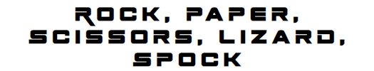
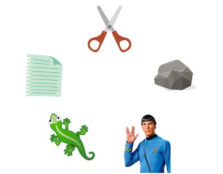
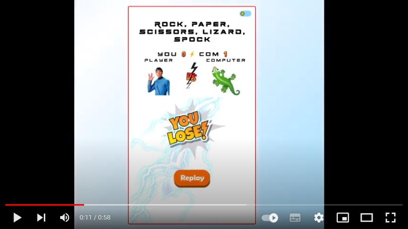

"Rock Paper Scissors Spock Lizard" game, developped in ReactJS, Typescript, SCSS, invented by Sam Kass and Karen Bryla.  
Extract from [Sam Kass's website](http://www.samkass.com/theories/RPSSL.html):  
> "I invented this game (with Karen Bryla) because it seems like when you know someone well enough, 75-80% of any Rock-Paper-Scissors games you play with that person end up in a tie. Well, here is a slight variation that reduces that probability. (Note that for those of you who like to swing your fist back and forth and say, "Rock, Paper, Scissors, GO!", might want to continue to do that, replacing "Rock" with "One," "Paper" with "Two," and "Scissors" with "Three.") This version is also nice because it satisfies the Law of Fives." 

You can report issues related to the game: [issues](https://github.com/delphinbock/spock/issues) 

## Rules
Each player picks a variable and reveals it at the same time. The winner is the one who defeats the others. In a tie, the process is repeated until a winner is found. 
1. Rock crushes Scissors or crushes Lizard 
2. Scissors cuts Paper or decapitates Lizard 
3. Paper covers Rock or disproves Spock 
4. Lizard eats Paper or poisons Spock 
5. Spock vaporizes Rock or smashes Scissors 

## Demo video game

## Notice
1. You play against the computer 
2. Pick one of the items displayed on the screen 
3. You have the result. You know if you won or lost 
4. If you won, the score counter increases, otherwise it's the computer's. 
5. You can keep playing as much as you want. 